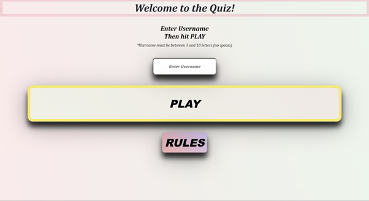
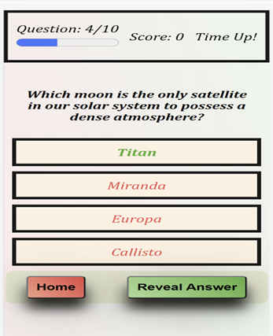

# Welcome to [Online Quiz](https://forgottenit.github.io/Quiz-Project/index.html)

# Goal
The Goal of this site is to have a quiz from which the user may pick their own categories from a wide variety of options and play a multiple choice quiz. 

# UX
## User Goals
-	Play a quiz that has a large variety of options
-	Be easy to use
-	Display when the answer is correct
-	Give an option to reveal the answers
- 	Keep a track of your score
-   Display Correct Answers if User gives incorrect answer
-   Have Easy to Read instructions and Rules

## User Stories
-	I want the site to have "replayability"
-   I want the site to display my score
-   I want to have options of which categories I want to be asked about in the quiz
-   I want variety
-   I want to receive feedback once my answer has been submitted
-   Have a timer to make the game more challenging

## Site owners Goals
-	Offer a variety of questions
-	Have a dynamically updated option of questions so players may replay it
-   Display questions and answers in an appealing manner
-	Have backup questions if the database that questions are taken from is down
-   Make the Game clear and Easy to play

## Requirements
-	Easy to navigate on different devices
-	Display categories and questions in an easy to understand manner
-	Track user entry and respond accordingly
-	Follow a clear layout
-	Keep score
-   Time Each Question and respond if Timer Runs out
-   Give the User the option to Reveal Answers
## Expectations
-	All answers and options to display correctly
-	Multiple options for the user
-	Visually appealing on all devices
-	All images and forms to load and run at a high performance level

# Design Choices
## Fonts
font-family: Cambria, Cochin, Georgia, Times, 'Times New Roman', serif;
font-family: 'Franklin Gothic Medium', 'Arial Narrow', Arial, sans-serif;
font-style: oblique;

I found these fonts to be neat and legible on different screens and are widely available
## Colours
background: linear-gradient(75deg, rgba(250, 26, 48, 0.1), rgba(32, 159, 58, 0.1));

The colour chosen was a gradient of Red and Green, with Greens and Reds picked for correct and incorrect answers as these would be standards expecting from the user. The background for answers is cream with black text to display text as it stands out. The Rules and Instructions are Blueish to Stand out from the Green and Red.

# Features
## Existing Features

 

### Landing Page

 

* Once the user lands on the page they are shown an option to enter username, play and rules. These Buttons are designed to have a 3D effect with box shadowing to make them stand out and also to draw attention from the User.

* The Username requires an input of letters only, a minimum of 3 letters, a maximum of 10. If the user enters an invalid username a warning is displayed.

 

 

* The User can also click on the "Rules" Button to get a brief summary of what to do.

 

 

* Once the User has Entered a Valid Username and they hit "Play", they are taken to the Category page.

 

### Categories

 

* The Site displays a greeting message, using the Username stored in local storage, and offers Users the chance to choose up to five different Categories. This allows them to select a total of 50 questions (This number was due to a maximum request of 50 questions per Fetch from Opentdb.com on their user guidelines). 

* The User also has the option to press the "Home" Button to return to the Home Screen. This clears the Local Storage also.

 

 

* The site also offers a Backup set of 20 General Knowledge questions that load if the Fetch attempt fails. The user is shown a warning message beforehand. 

 

 

* If the User picks no Categories, or more than 5 categories, a warning is shown.

 

 

* Once the User is happy with their Category Choices, they can press "Start".

 

### Quiz Section

 

* The display for the Questions is then shown, with a menu on the top showing a progess bar, the amount of Questions, the users Score and a Timer. The Timer is set for 15 seconds per question. The progress bar fills as the player goes through each question, as does the question count. The timer counts down to Zero, then the answer is displayed. (Once the timer goes below 10s, it is displayed as 09, 08 etc. by adding a Zero to the front of it)

 

 

* The User selects one of Four possible answers, if it is correct theire Selection turns Green for a Couple seconds before the next Question is displayed.

 

 

* If the User gets a Question incorrect, they are Shown the correct Answer

 

 

* If the User clicks Reveal Answer, or the Timer runs out, they are shown the Correct Answer with a different display

 

 

* For Each Scenario (Correct, Incorrect, TimeOut/Reveal) the background Colour and Font-Weight changes to Show the User the correct Answer. Also, if the user Clicks Reveal Answer or the Timer runs out, the Answer becomes "Unclickable" so they can't choose the option after being shown the correct answer.

 

### Score Page

 

* This displays the users final score and gives a different message depending on how they did. The Message at the top gives a Rounded Percentage Score while the Message varies depending on how well they did. The Background Colour and the Font Colours change also, depending on how succesful the player was.

<

# Future Features 
-	Scores to be stored so a leadership board could be implemented
-	Multiple player options

 
# Technologies used
## Languages
- HTML for structuring website
- CSS for styling website
- Java Script for functions

## Tools
- GitPod and GitHub for Coding and Hosting the Website
- CodeInstitute for Mentors and Tutors
- LightHouse
- https://validator.w3.org/ for validating site for HTML and CSS
- https://jshint.com/ for validating JS
 
# Testing
-	HTML
No errors were returned when passing through the official W3C validator
- CSS
No errors were found when passing through the official (Jigsaw) validator
- JS 
No errors when passed through JS hint
- Manually tested to ensure all links worked, that scores displayed, timer worked, backup JSON file worked on "Fetch" failure, alerts worked if user tried to fetch too many categories, didn't enter a valid username.

## Lighthouse

 
# General Testing

- After site was ran through w3 validators, the site was tested for functionality.
- Functionality testing involved ensuring all links were active, that all user submission worked, displays worked correctly
- Testing also involved general lay-out testing of alternate design choices before the ones used were settled upon.
- Finally, testing also involved demonstration of the active site to mt CodeInstitute Mentor 
# Deployment
Following writing the code then commiting and pushing to GitHub, this project was deployed using GitHub by the following steps.
-	Navigate to the repository on github and click 'Settings'.
-	Then select 'Pages' on the side navigation.
-	Select the 'None' dropdown, and then click 'master'.
-	Click on the 'Save' button.
-	Now the website is now live on  https://forgottenit.github.io/Online-Grinds/
-	If any changes are required, they can be done, commited and pushed to GitHub and the changes will be updated.

 
# Credits
## For coding help and advice
-	Simen Daehlin
-	Rohit Sharma
-	CodeInstitiute
-   Stack OverFlow
-   https://bost.ocks.org/mike/shuffle/ for fisher-yates shuffle 
 
## For content and style 
-   https://ui.dev/amiresponsive? for README image 
-	CodeInstitute
-	W3Schools.com

